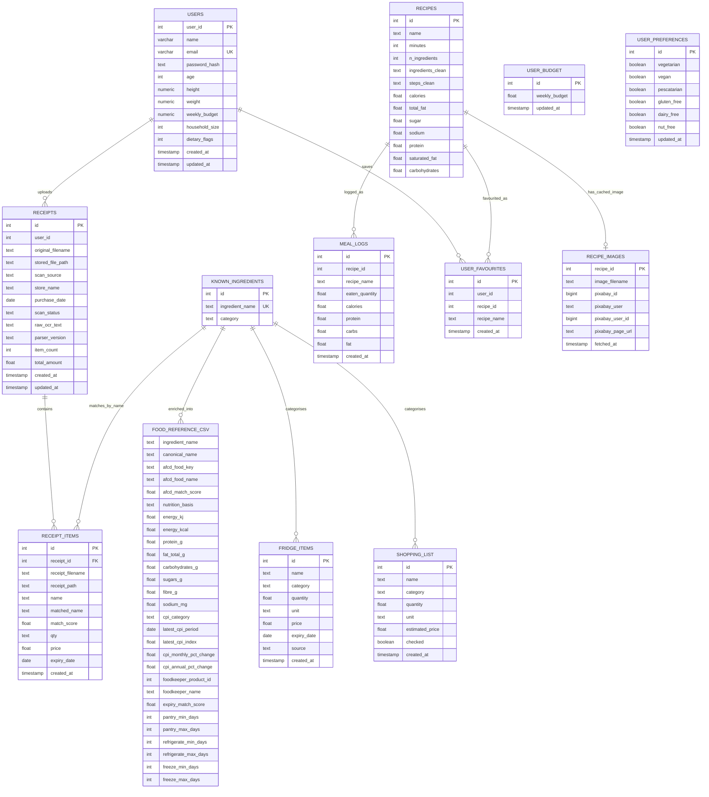

# Data ERD

This ERD shows the current PostgreSQL app schema plus the processed
`food_reference.csv` artifact from the data pipeline.

## Reading Notes

- `RECEIPTS -> RECEIPT_ITEMS` is the main enforced foreign-key relationship in
  the live database.
- Several relationships are application-level rather than enforced by database
  foreign keys, especially `user_id`, `recipe_id`, and ingredient-name matches.
- `FOOD_REFERENCE_CSV` is currently a processed CSV artifact, not a live
  PostgreSQL table. It is included here because it is the planned enrichment
  layer for ingredient nutrition, CPI trend, and expiry data.
- Current fridge routes use `RECEIPT_ITEMS` as the virtual fridge. `FRIDGE_ITEMS`
  exists as a table but is not the main route-backed storage today.
